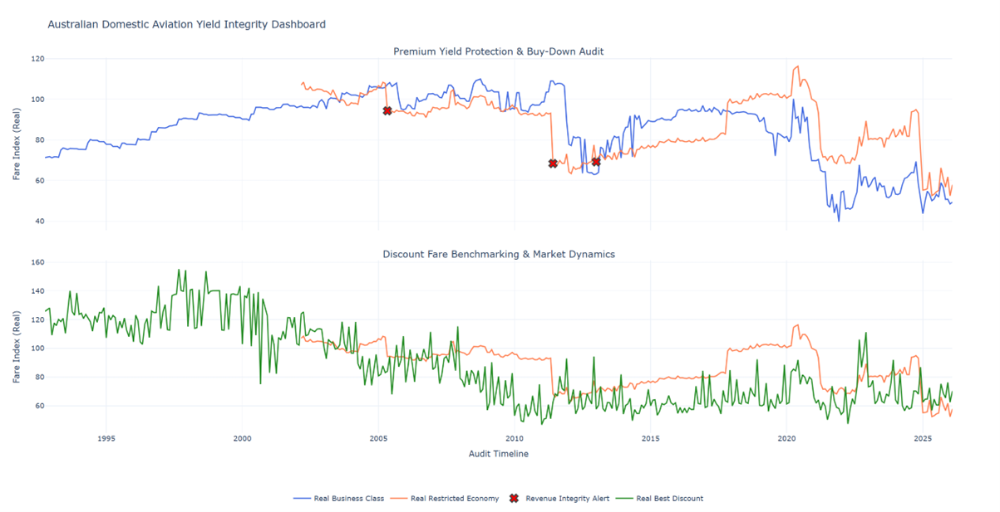

# Australian Domestic Aviation Yield Integrity Audit



---

## Project Overview

A high-performance Python engine designed for revenue integrity and market pricing analysis. It detects yield compression and premium buy-down risks in Australian domestic aviation data using BITRE (Bureau of Infrastructure, Transport and Regional Economics) air fare indices.

---

## Key Audit Capabilities

- **Yield Integrity Alerts**: Automated detection of price anomalies between fare classes, flagging months where Restricted Economy drops sharply while Business Class remains stable.

- **Buy-Down Risk Analysis**: Monitoring spreads between Business and Restricted Economy buckets to identify premium leakage and structural market shifts.

- **Market Dynamics Benchmarking**: Auditing tactical discount effectiveness against secondary fare classes, tracking the evolution of Best Discount vs Restricted Economy pricing.

---

## Technical Architecture

The code is modularized into a clear data pipeline:

| Function | Purpose |
|----------|---------|
| `load_and_clean_data()` | Ingestion and preprocessing of BITRE CSV/XLSX files |
| `calculate_audit_metrics()` | Statistical anomaly detection logic (MoM % change, Revenue Integrity Alert flags) |
| `generate_dashboard()` | Interactive Plotly visualization engine and HTML output |

---

## Tech Stack

- **Python** — Runtime
- **Pandas** — Data loading and analysis
- **Plotly** — Interactive visualizations
- **openpyxl** — Excel file support
- **Git** — Version control

---

## Setup

1. Clone the repository:
   ```bash
   git clone <repository-url>
   cd BITRE_Airline_Audit
   ```

2. Install dependencies:
   ```bash
   pip install -r requirements.txt
   ```

3. Download the latest Domestic Air Fares time series (XLSX) from the [official BITRE Aviation Statistics page](https://www.bitre.gov.au/statistics/aviation/air_fares). Save it in the project directory as `air_fares.xlsx` (the script automatically detects files starting with `air_fare` or `air_fares`).

4. Run the audit:
   ```bash
   python audit_engine.py
   ```

5. Open `trend_analysis.html` in a browser to view the interactive dashboard.

---

## 💡 Dashboard Image for GitHub

For the chart image to display in this README:

1. Take a screenshot of your final chart from `trend_analysis.html`.
2. Name it `dashboard.png`.
3. Place it in the main project folder.
4. The `` reference above will then display the image on GitHub.
